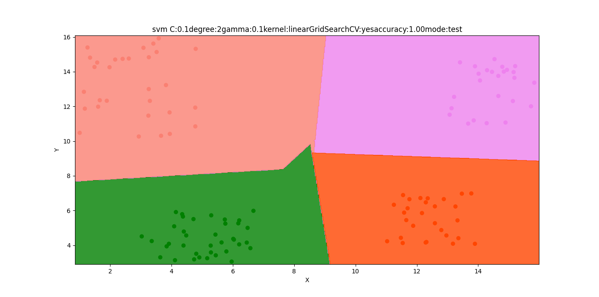

# Directory Structure
```text
.
├── api_test.py
├── app.py
├── data
│   └── clusters.csv
├── docker-compose.yml
├── Dockerfile
├── figures
│   ├── Figure_cm_C:0.1degree:2gamma:0.1kernel:linearGridSearchCV:yesaccuracy:1.00.png
│   ├── Figure_cm_C:100.0kernel:polydegree:3gamma:10.0accuracy:1.00.png
│   ├── Figure_cm_C:1.0kernel:polydegree:3gamma:10.0accuracy:1.00.png
│   ├── Figure_data.png
│   ├── Figure_pred_2.3_9.1.png
│   ├── Figure_pred_9.3_10.2.png
│   ├── Figure_pred_9.7_8.1.png
│   ├── Figure_preds_C:0.1degree:2gamma:0.1kernel:linearGridSearchCV:yesaccuracy:1.00mode:test.png
│   ├── Figure_preds_C:0.1degree:2gamma:0.1kernel:linearGridSearchCV:yesaccuracy:1.00mode:train.png
│   ├── Figure_preds_C:1.0kernel:polydegree:3gamma:10.0accuracy:1.00mode:test.png
│   └── Figure_preds_C:1.0kernel:polydegree:3gamma:10.0accuracy:1.00mode:train.png
├── README.md
├── run.py
├── utils
│   ├── config.py
│   ├── data.py
│   ├── __init__.py
│   ├── model.py
│   └── plot.py
└── weights
    ├── svm-3i4hl.pkl
    ├── svm-79b55.pkl
    ├── svm-99gag.pkl
    ├── svm-b51wo.pkl
    ├── svm-dia1e.pkl
    ├── svm-h45lt.pkl
    ├── svm-kmvv1.pkl
    ├── svm-r6890.pkl
    ├── svm-tlfqy.pkl
    ├── svm-vyg09.pkl
    ├── svm-wcak5.pkl
    └── svm-ywuvv.pkl

4 directories, 35 files
```

# Command Line Interface
```text
usage: run.py [-h] [--load LOAD] [--gen GEN] [--gs GS] {linear,rbf,poly} ...

positional arguments:
  {linear,rbf,poly}  Choose kernel for SVM model
    linear           linear kernel
    rbf              rbf kernel
    poly             poly kernel

optional arguments:
  -h, --help         show this help message and exit
  --load LOAD        True: Load trained model False: Train model default: True
  --gen GEN          True: Generate Fake data False: Use already generated
                     data default: False
  --gs GS            True: Run GridSearchCV default: False
```
# Plot Data
### Features: x,y
### Labels: cluster key


# Generate Fake Data
```shell
python run.py --gen yes
```

# Train the SVM model
#### SVM parameters
```text
Kernel: linear, rbf, poly 
```
```text
Gamma: 0.1, 1, 10, 100
```
```text
C: 0.1, 1, 10, 100, 1000
```
```text
Degree: 2, 3, 4, 5, 6
```
### Find Optimal Parameters with 10-Fold GridSearchCV
```shell
python run.py --load no --gen no --gs yes
```

### Confusion Matrix


## Accuracy Score: 1

```text
Do you want to save the model weight? yes
Model saved at weights/svm-99gag.pkl
```
### Best Optimal Parameters with 10-Fold GridSearchCV

```text
kernel: linear
```
```text
gamma:0.1
```
```text
C: 0.1
```
```text
degree: 2
```
## Prediction Boundary for all clusters
### for Train data

### for Test data



### Training with custom parameters

```shell
python run.py --load no --gen no --gs no poly --degree 3 --gamma 10 --C 1
```
## Confusion Matrix


## Accuracy Score: 1

```text
Do you want to save the model weight? yes
Model saved at weights/svm-kmvv1.pkl
```

## Prediction Boundary for all cluster
### for Train data

### for Test data

## Prediction cluster for (2.3,9.1)


## Prediction cluster for (9.3,10.2)


## Prediction cluster for (9.7,8.1)


# Load the trained model

```shell
python run.py --load yes --gen no
```


# Docker for the model

## Build the Docker image

You can build docker image by following:

```shell
docker-compose build
```

## Run Docker container

You can launch a container from the Docker image by following:

```shell
docker-compose up
```